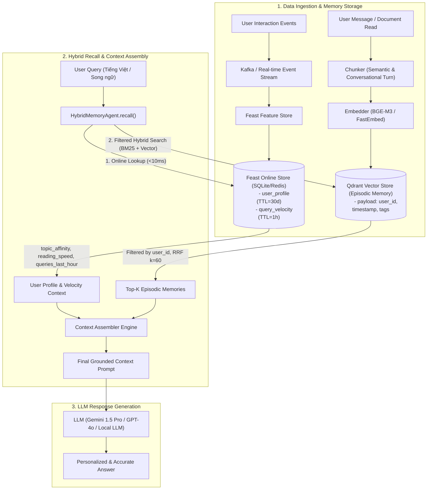

# Kiến Trúc Hệ Thống Hybrid AI Memory Cho Trợ Lý Cá Nhân (Vietnamese Personal AI Assistant)

> **Contributors:** AICB Cohort A20 - Track 2 Day 19  
> **Topic:** Hybrid Episodic & Profile Memory Architecture for Vietnamese AI Assistant  

---

## 1. Sơ đồ kiến trúc tổng thể (System Architecture)

Hệ thống AI Memory kết hợp hai trụ cột lưu trữ chuyên biệt: **Episodic Memory (Bộ nhớ sự kiện/ngữ cảnh)** qua Vector Database và **Stable Profile & Real-time State (Hồ sơ người dùng & Trạng thái)** qua Feature Store.

---

## 2. Ba Quyết Định Kiến Trúc & Đánh Đổi (3 Architecture Decisions with Explicit Tradeoffs)

### Quyết định 1: Chunking Strategy cho Episodic Memory
* **Lựa chọn:** **Hierarchical Conversation Turn + Semantic Sliding Window (256 tokens, overlap 32 tokens)**.
* **Đánh đổi (Tradeoff):**
  * *Per-message chunking (Quá nhỏ):* Mất ngữ cảnh hội thoại đa lượt (multi-turn coreference), câu hỏi như "nó hoạt động thế nào?" không tìm được chủ ngữ.
  * *Per-conversation chunking (Quá lớn):* Vượt quá ngân sách ngữ cảnh khi gộp nhiều ký ức, làm loãng vector embedding dẫn đến điểm cosine thấp.
  * *Lý do chọn:* 256 tokens vừa vặn chứa một ý trọn vẹn trong tiếng Việt (khoảng 3–5 câu), đảm bảo tính cô đọng khi RRF ranking lấy top-3 đoạn ký ức quan trọng nhất đưa vào prompt mà không làm tràn context window của LLM.

### Quyết định 2: Feature Schema & Lưu trữ Profile người dùng
* **Lựa chọn:** **Phân tách 2 nhóm Tabular Features trong Feast (User Profile + Query Velocity)** thay vì dùng Latent Vector Profile.
* **Đánh đổi (Tradeoff):**
  * *Latent Vector Profile (Embedding sở thích người dùng):* Có khả năng bắt được sở thích ngầm nhưng là "hộp đen" (black-box), khó debug, tốn chi phí inference vector search 2 lần và không kiểm soát được các rule cứng (ví dụ: ngôn ngữ bắt buộc `preferred_language=vi`).
  * *Tabular Features:* Định nghĩa rõ ràng (`reading_speed_wpm`, `preferred_language`, `topic_affinity`, `queries_last_hour`), chi phí lookup siêu thấp (< 2ms trên SQLite / < 1ms trên Redis), dễ dàng diễn giải và can thiệp thủ công (prompt templating trực tiếp).
  * *Lý do chọn:* Tính minh bạch, kiểm soát được hành vi model và tốc độ truy xuất cực nhanh ở tầng serving.

### Quyết định 3: Freshness Strategy & Độ trễ cập nhật ký ức
* **Lựa chọn:** **Chiến lược phân tầng đa tầng (Multi-tier Freshness):**
  1. *Sub-second (Real-time Push):* Đoạn hội thoại hoặc ghi chú mới được embed và upsert vào Qdrant ngay lập tức; câu hỏi tiếp theo có thể truy xuất tức thì.
  2. *5-minute Streaming Window:* Feature `queries_last_hour` và `distinct_topics_24h` được cập nhật qua stream aggregator để nhận biết trạng thái làm việc liên tục của người dùng.
  3. *Daily Batch Materialization:* Phân tích sở thích dài hạn (`topic_affinity`, `reading_speed_wpm`) chạy batch qua đêm (Point-in-Time join trên Parquet/Data Warehouse) để chống nhiễu (noise) từ các hoạt động nhất thời trong ngày.

---

## 3. Lựa Chọn Bị Loại Bỏ & Lý Do (Rejected Alternative)

* **Phương án xem xét:** **Lưu toàn bộ Episodic Memory vào Feature Store dưới dạng Embedding Feature View (Feast On-Demand Vector View).**
* **Lý do loại bỏ:**
  1. *Khác biệt về chu kỳ vòng đời (Lifecycle mismatch):* Ký ức episodic phát sinh liên tục theo từng tin nhắn (hàng chục lần/phút) trong khi feature view của Feature Store được thiết kế cho việc trích xuất theo entity ID ổn định.
  2. *Thiếu khả năng tìm kiếm Approximate Nearest Neighbor (ANN) linh hoạt:* Feature Store tối ưu cho key-value point lookup (`O(1)`), không tối ưu cho đồ thị HNSW đa chiều và bộ lọc thuộc tính phức tạp như Qdrant.
  3. *Tách biệt trách nhiệm (Separation of Concerns):* Tách Vector DB (truy xuất ngữ nghĩa) và Feature Store (truy xuất trạng thái/thuộc tính) giúp tối ưu hóa chi phí scaling độc lập.

---

## 4. Cân Nhắc Đặc Thù Ngữ Cảnh Tiếng Việt (Vietnamese-Context Considerations)

1. **Xử lý hiện tượng trộn ngữ (Code-switching VN/EN):**
   - Người dùng công nghệ tại Việt Nam thường xuyên dùng câu hỏi pha trộn (ví dụ: *"Cách setup CI/CD pipeline với Docker và Kubernetes"*).
   - Sử dụng BM25 với whitespace tokenization kết hợp Vector Embeddings đa ngữ (`bge-m3` hoặc `multilingual-e5-large`) giúp bắt trọn cả keyword kỹ thuật tiếng Anh nguyên bản lẫn ý nghĩa ngữ cảnh tiếng Việt.
2. **Khả năng chịu lỗi gõ Telex và biến thể từ:**
   - Vector search giải cứu các trường hợp gõ sai dấu hoặc cách hành văn tự nhiên không trùng khớp từ vựng trong tài liệu gốc (paraphrase).
3. **Quy định bảo vệ dữ liệu cá nhân (Nghị định 13/2023/NĐ-CP):**
   - Dữ liệu người dùng bắt buộc phải được cô lập theo `user_id` ở tầng Vector DB (Filtered-ANN) và Feature Store. Tuyệt đối không chia sẻ chung vector space không có namespace để tránh rò rỉ dữ liệu chéo người dùng (OWASP LLM08).

---

## 5. Giới Hạn Hiện Tại Của Bản POC (What This POC Doesn't Handle Yet)

1. *Chưa mã hóa dữ liệu tĩnh (Encryption at Rest)* trên file storage của SQLite và Qdrant local storage.
2. *Chưa có cơ chế Memory Consolidation tự động* (tổng hợp 10 ký ức tương đồng của tuần trước thành 1 bản tóm tắt duy nhất qua background worker).
3. *Chưa hỗ trợ Multi-device Real-time Sync conflict resolution*.
